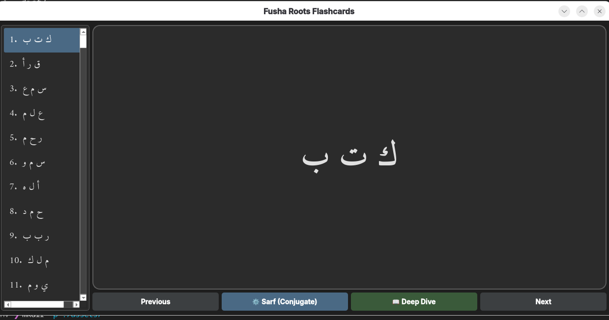
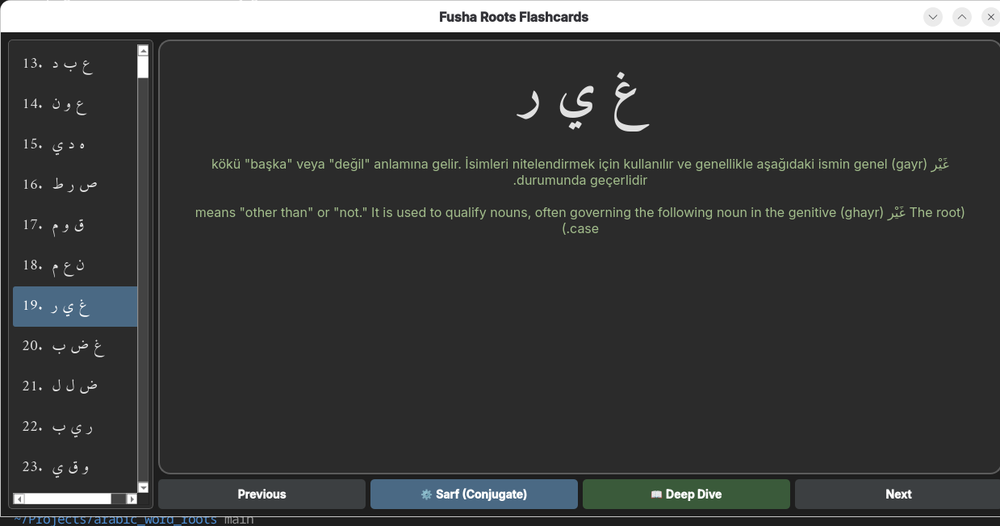
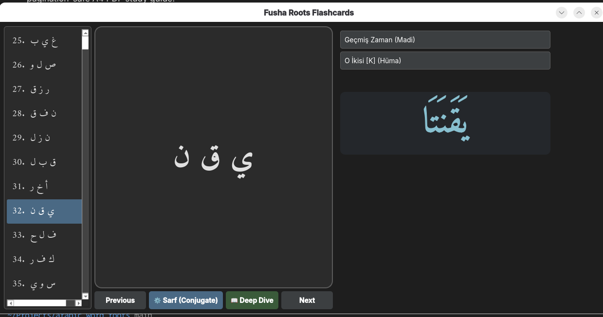
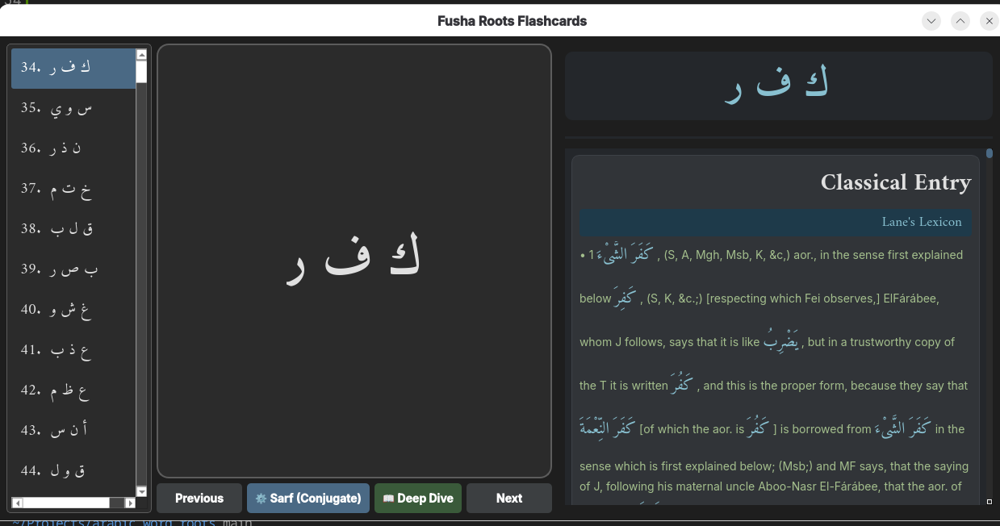
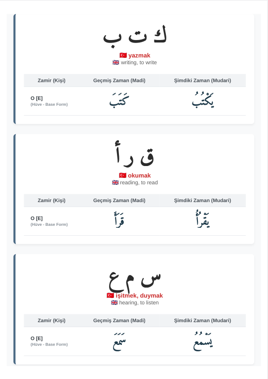

# Fusha Arabic Roots: Lexical Intelligence & Morphological Study Suite

A high-performance offline application and data processing pipeline designed to master Classical Arabic (Fusha) root-and-pattern morphology. Built with **Python**, **PySide6**, and **SQLite**, this system integrates multi-source ETL pipelines, automated web scraping, algorithmic morphological conjugation engines, and automated document generation.

---

## 1. Desktop Application Usage Guidance (Capabilities)

The graphical user interface (GUI) is built using **PySide6** with a modern, responsive three-column architecture tailored for intensive study sessions. Here is a walkthrough of what the application looks like in action and how its core features operate:

* **Main Flashcard Dashboard:** 
  The clean, dark-themed interface displays primary 3-letter roots with translations hidden by default to support active recall. Users can easily navigate through thousands of roots using intuitive controls or keyboard buttons.
  
  

    
  

* **Active Recall & Meanings:** 
  Clicking on the Arabic root card instantly reveals the Turkish and English definitions, rendered cleanly inside a scrollable layout powered by custom UI styling.

  

    
  

* **Dynamic Sarf (Morphology) Panel:** 
  Powered by an algorithmic Python backend (`SarfEngine`), this toggleable side panel computes real-time past (*Madi*), present (*Mudari*), and future (*Mustakbel*) conjugations across different pronoun (*Zamir*) conditions instantly as you switch words.

  

    
  

* **Deep Dive Lexicon Viewer:** 
  Leveraging advanced **Regular Expression (RegEx)** data-parsing routines, this view normalizes complex, multi-source XML and HTML definitions from classical lexicons into structured, easy-to-read bulleted cards with custom font scaling.

  

    
  

* **Print-Optimized PDF Export:** 
  Using a headless Chromium engine via **Playwright**, the application transforms database queries into a beautifully formatted, publication-ready A4 study guide complete with professional typography.

  

    
  

---

## 2. How the Word Roots Are Obtained from Different Sources

The project utilizes an automated **Extract, Transform, Load (ETL)** pipeline to aggregate data from disparate open-source repositories into a unified, normalized **SQLite (`roots.sqlite3`)** relational database:

* **Direct CDN Ingestion:** Automated scripts (`data_fetcher.py`) bypass API rate limits by querying raw JSON datasets directly from repository content delivery networks (e.g., Quranic root indexes).
* **Raw Corpus Parsing:** Ingestion scripts (`expand_database.py`) download raw text matrices from linguistic repositories (`linuxscout/arabic-roots`), applying strict regex filters to extract valid 2-to-4 letter Arabic graphemes while filtering out structural noise.
* **Automated Translation Injection:** Integrates the `deep-translator` library with rate-limited, human-like jitter delays to map localized English glosses to real-time Turkish translations before batch-committing rows into the database.

---

## 3. How the Almaany and Descriptions Are Written

To enrich the core roots with advanced classical definitions and modern meanings, the application utilizes two advanced data collection and cleaning strategies:

* **Multithreaded Web Scraping (`scrape_almaany.py`):** 
  * Employs Python's `ThreadPoolExecutor` alongside `BeautifulSoup` and `requests` Sessions to extract deep definition blocks from Almaany.
  * Features an intelligent **IP Backoff & Rate-Limit Mitigation System** that dynamically detects HTTP status codes (`403`, `429`) and enforces global thread-safe cool-down timers to prevent blocking.
* **Relational Database Merging (`merge_lanes.py`):** 
  * Cross-references and merges external classical lexicons (such as Lane’s Lexicon SQLite database) by programmatically utilizing SQL `ATTACH DATABASE` operations.
  * Utilizes advanced SQL aggregation via `GROUP_CONCAT` combined with custom regex sanitization to stitch multi-row XML definition fragments into unified, readable entry blocks.

---

## 4. How Pronouns and Zamirs Are Regulated in PDF Conversion

Generating a printable study guide for thousands of roots introduces a combinatorial explosion if every single pronominal variation is printed explicitly. The document generation pipeline (`generate_pdf_guide.py` & `convert_to_pdf.py`) resolves this efficiently:

* **The Dictionary Standard Approach:** Following professional lexicographical standards (similar to Hans Wehr), the guide avoids clutter by displaying word cards in their foundational **3rd Person Masculine Singular (*Hüve*) base form** for both past and present tenses.
* **The Master Mathematical Guide:** Page one of the PDF features an analytical breakdown of Arabic morphology, detailing the exact algebraic formulas for suffixes and prefixes. A master 14-row conjugation matrix using a model root (`ك ت ب`) demonstrates how any pronoun can be derived mathematically from the base form.
* **Headless Browser Rendering:** The script compiles database queries into a print-optimized HTML document styled with professional web typography (*Amiri* and *Inter* fonts). This HTML is then processed by a headless **Chromium** instance via **Playwright** (`convert_to_pdf.py`) to output a pixel-perfect, pagination-safe A4 PDF study guide.

---

## 5. Author & Creator

* **Vasif Asadov** 

*Certified Microsoft Power BI Data Analyst Associate & Data Scientist specializing in relational database architectures, Python data pipelines, automation scripting, and algorithmic application design.*

